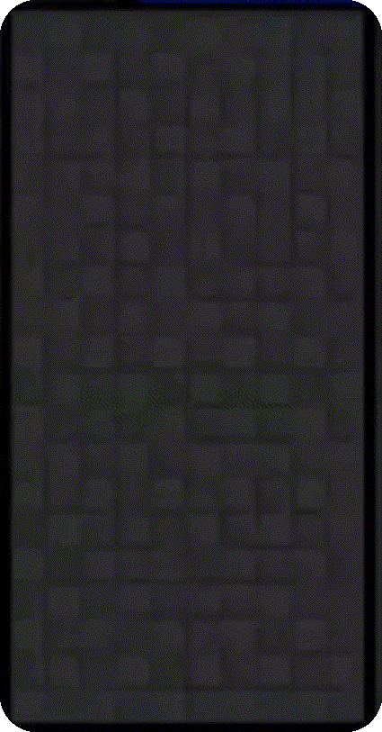

# **TetrisBattle AI with Q-learning**

This project explores the application of Q-learning, a reinforcement learning technique, to train an AI model for playing Tetris Battle. The focus is on the dueling mode of Tetris, where two players compete and can harass opponents by adding rows to their board.

## **Methodology**

- Deep Q Network (DQN) as the primary reinforcement learning algorithm
- State representation refined by pre-simulating possible block movements
  - Focus on block orientation and final landing position
  - Reduced state space while retaining essential information (height, lines cleared, holes, bumpiness)
- Network architecture
  - Simple feed-forward neural network
  - Fully connected linear layers with ReLU activation functions
- Training techniques
  - Experience replay
  - Epsilon-greedy policy

## **Training Process**

1. Single-player mode
   - Fitness function as the initial reward to encourage tidy block stacking
   - Reward function changed to the original game score once the model learned to clear lines
2. Double-player mode
   - Model trained by playing against itself
   - Reward based on the game outcome (winner: 1 point, loser: 0 points)

## **Features**

- 2-player dueling mode
- UI
- T-spin and Tetris
- Back-to-back
- Garbage lines
- Alarm for attacks
- Hold function

## **Demo**
We've trained 2 models to battle with each other.
The left one is actor critic model, and the right one is DQN model.
Since the winner is DQN model so it became our final model.

### Fight video


### DQN model in single-player mode



## **Report**
For a detailed analysis of our methodology and findings, please refer to our [project report](https://drive.google.com/file/d/your_report_link_here).

## **Requirements**
- Python 3
- Pygame
- Linux system

Note that Pygame might have conflicts with macOS. The program has been tested on macOS 10.14.6 with `pygame==2.0.0.dev1` and `python==3.7.4`.

## **Installation**
```
python setup.py develop
```

## **Usage**
### Single player mode
```
python -m game.tetris_game --mode single
```

### Two players mode
```
python -m game.tetris_game --mode double
```

## **Acknowledgements**
This work is based on the following repository:
1. https://github.com/xuyuwei/tetris-battle
